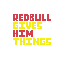
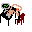

# Redbull Gives Him Things  

  

A chaotic caffeine-fueled platformer where the only way to survive is to chug endless Redbulls and defy the limits of human coding endurance.  

---

## 🎮 Gameplay  
- Play as a **sleep-deprived coder** desperately trying to stay awake through the night.  
- Capture **Redbull cans** to gain speed, power, and strange abilities.  
- Avoid enemies, bugs, and the crushing weight of deadlines.  
- Survive long enough to finish the game… or collapse mid-keystroke.  

---

## 🖼️ Assets  

Characters and art included in the game:  
-  **The Coder** – fueled only by caffeine and bad decisions.  
-  **Jimmy** – the sound guy, eternal riff master at 3 AM.  
-  **Title Screen** – official logo for the project.  

---

## ⚙️ Tech Stack  
- **Python 3**  
- **PyGame** (primary game framework)  
- Built during a series of late-night coding sessions powered by unhealthy amounts of caffeine.  

---

## 🚀 Running the Game  
1. Clone or download this repo.  
2. Install requirements:  
   ```bash
   pip install pygame

